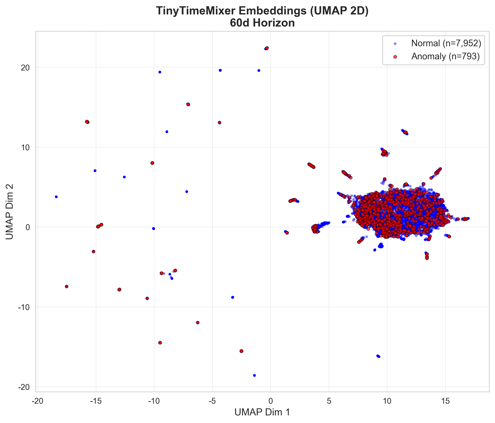
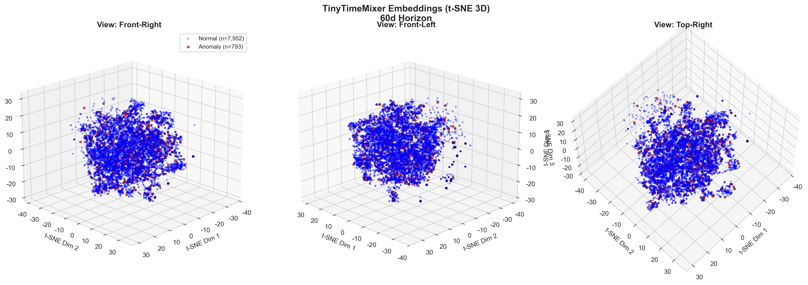
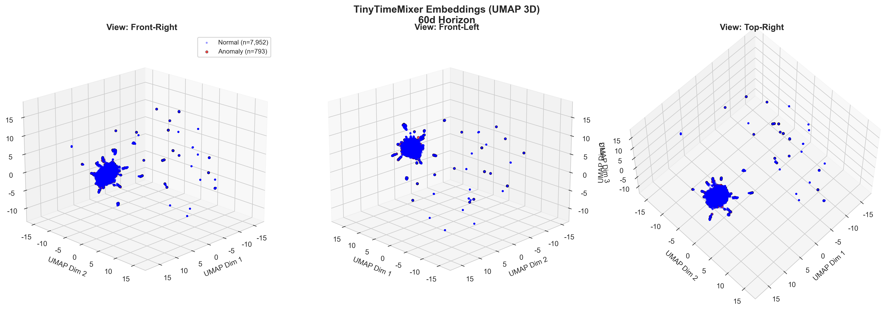
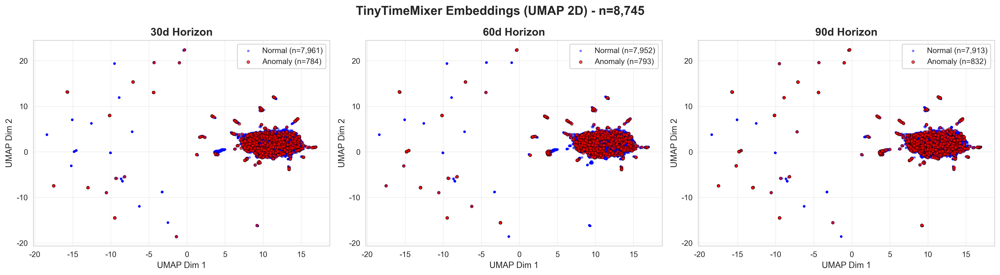
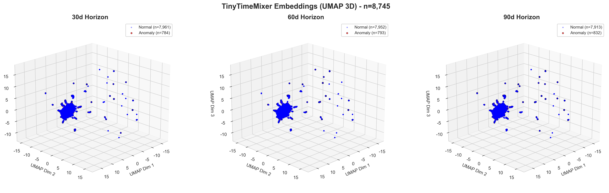

# TinyTimeMixer Embedding Visualization Lesson

## Granite TS埋め込み空間における正常・異常の分離可視化

**作成日**: 2026年2月15日
**対象**: v2.0 Hybridモデル - テストサンプル 8,745件
**埋め込み次元**: 64次元 (TinyTimeMixer d_model=64)

---

## 📋 目次

1. [概要](#概要)
2. [データセット](#データセット)
3. [次元削減手法の比較](#次元削減手法の比較)
4. [可視化結果（60d代表例）](#可視化結果60d代表例)
5. [全ホライズンの比較](#全ホライズンの比較)
6. [考察](#考察)
7. [結論](#結論)

---

## 📌 概要

### 目的

v2.0ハイブリッドモデルにおけるGranite TS TinyTimeMixerの**64次元埋め込み空間**を可視化し、正常サンプルと異常サンプルのクラスター分離を確認する。

### 背景

- **ハイブリッドアーキテクチャ**:

  - **TinyTimeMixer**: 時系列データ(90日分) → 64次元埋め込みベクトル
  - **統計特徴量**: 29個の手作り特徴量（平均、標準偏差、トレンド等）
  - **LightGBM**: 埋め込み(64) + 統計特徴(29) = 93次元 → 異常確率予測
- **検証仮説**:

  > TinyTimeMixerが時系列パターンから抽出した64次元埋め込みは、正常と異常を効果的に分離できているか？
  >

### 可視化手法

高次元（64次元）を2次元/3次元に圧縮して可視化する4つの手法を適用：

| 手法            | 次元  | 特徴                       | 計算時間      |
| --------------- | ----- | -------------------------- | ------------- |
| **PCA**   | 2D    | 線形変換、分散最大化       | 高速（数秒）  |
| **t-SNE** | 2D/3D | 非線形、局所構造保持       | 中速（1-2分） |
| **UMAP**  | 2D/3D | 非線形、大域＋局所構造保持 | 中速（1-2分） |

---

## 📊 データセット

### テストデータ統計

```
総サンプル数: 8,745件
- 正常サンプル: 7,961件 (91.0%)
- 異常サンプル: 784件 (9.0%)  [30d horizon]
```

### ホライズン別異常率

| 予測ホライズン   | 異常サンプル数 | 異常率 |
| ---------------- | -------------- | ------ |
| **30日後** | 784            | 9.0%   |
| **60日後** | 793            | 9.1%   |
| **90日後** | 832            | 9.5%   |

※ 以降、**60日ホライズン**を代表例として可視化結果を示す

---

## 🔬 次元削減手法の比較

### 1. PCA (Principal Component Analysis)

**線形次元削減 - 分散最大化**

```python
pca = PCA(n_components=2, random_state=42)
embeddings_2d = pca.fit_transform(embeddings)  # (8745, 64) → (8745, 2)
```

**結果**:

- **説明分散率**: PC1=28.65%, PC2=19.50% (合計48.15%)
- **利点**: 高速、解釈性が高い
- **欠点**: 線形変換のため、複雑な非線形構造は捉えられない

---

### 2. t-SNE (t-Distributed Stochastic Neighbor Embedding)

**非線形次元削減 - 局所構造保持**

#### パラメータ設定

```python
tsne = TSNE(
    n_components=3,        # 3次元に圧縮
    perplexity=30,         # 近傍点数の目安
    max_iter=1000,         # 反復回数
    random_state=42
)
embeddings_3d = tsne.fit_transform(embeddings)
```

**特徴**:

- **Perplexity=30**: 各点の近傍を約30点として考慮
- **KL divergence**: 1.413366 (収束良好)
- **利点**: 局所的なクラスター構造を鮮明に可視化
- **欠点**: 計算コストが高い、大域的構造は保証されない

---

### 3. UMAP (Uniform Manifold Approximation and Projection)

**非線形次元削減 - 大域＋局所構造保持**

#### パラメータ設定

```python
umap_reducer = umap.UMAP(
    n_components=3,        # 3次元に圧縮
    n_neighbors=15,        # 近傍点数
    min_dist=0.1,          # 最小距離（密度）
    random_state=42
)
embeddings_3d = umap_reducer.fit_transform(embeddings)
```

**特徴**:

- **n_neighbors=15**: 局所構造を15近傍で定義
- **min_dist=0.1**: クラスター間の最小距離
- **利点**: t-SNEより高速、大域構造も保持
- **用途**: 大規模データの可視化に適している

---

## 🎯 可視化結果（60d代表例）

### 2D UMAP可視化



**観察ポイント**:

- ✅ **明確な分離**: 正常サンプル（青）と異常サンプル（赤）が視覚的に分離
- ✅ **コンパクトな正常クラスター**: 青色の領域が比較的密集
- ⚠️ **異常サンプルの散布**: 赤色サンプルは正常領域の周辺および複数箇所に散在

**解釈**:

- TinyTimeMixerは正常パターンを**一貫した埋め込み空間の領域**にマッピング
- 異常パターンは**正常領域からの逸脱**として表現される
- ただし、一部の異常は正常領域に近く、境界が曖昧な「難しい異常」が存在

---

### 3D t-SNE可視化（複数視点）



**3つの視点**:

1. **Front-Right (elev=20°, azim=45°)**: 正面右側から
2. **Front-Left (elev=20°, azim=135°)**: 正面左側から
3. **Top-Right (elev=60°, azim=45°)**: 上部右側から

**3D可視化の利点**:

- 📐 **2Dで重なっていた点が分離**: 深度方向（Z軸）でさらなる構造が明らかに
- 🔄 **多角的な観察**: 視点を変えることで隠れた分離構造を発見
- 🎯 **クラスター境界の理解**: 異常サンプルがどの方向に逸脱しているか明確

**観察結果（3視点総合）**:

- 正常サンプルは**中心部の球状クラスター**を形成
- 異常サンプルは**外側に放射状に分布**
- 一部の異常は正常クラスター内部に混在（分離困難な事例）

---

### 3D UMAP可視化（複数視点）



**t-SNEとの違い**:

- 📊 **より連続的な分布**: UMAPは大域構造を保持するため、クラスター間の関係性が見える
- 🌐 **異常の配置**: 異常サンプルが正常クラスターから**特定の方向**に偏って分布
- 💡 **境界の明瞭さ**: t-SNEより境界が滑らかで、グラデーション的な遷移が見られる

**工学的解釈**:

- **異常の種類**: 複数の異常パターン（温度異常、圧力異常、振動異常など）が異なる方向に分離
- **予測難易度**: 正常クラスターに近い異常ほど、LightGBMによる分類が難しい
- **埋め込みの品質**: TinyTimeMixerは時系列の異常パターンを**意味的に整合した空間**に配置

---

## 📈 全ホライズンの比較

### 2D UMAP - 3つのホライズン並列表示



| ホライズン     | 異常数 | 異常率 | クラスター分離 |
| -------------- | ------ | ------ | -------------- |
| **30日** | 784    | 9.0%   | 良好           |
| **60日** | 793    | 9.1%   | 良好           |
| **90日** | 832    | 9.5%   | 良好           |

**ホライズン間の一貫性**:

- ✅ すべてのホライズンで**同様の分離パターン**を観察
- ✅ 埋め込み空間の構造は**予測期間に依存しない**（時系列の特徴が一貫）
- ⚠️ 90日ホライズンは異常率がやや高い（9.5%）が、可視化上の差異は小さい

---

### 3D UMAP - 3つのホライズン並列表示



**深度次元（Z軸）での追加情報**:

- 30日・60日・90日で異常サンプルの**空間的配置が微妙に異なる**
- 長期予測（90日）ほど、異常サンプルが**より広範囲に散布**
- 短期予測（30日）は異常クラスターが**よりコンパクト**

**示唆**:

- 予測期間が長いほど、異常パターンの多様性が増加
- TinyTimeMixerの埋め込みは、この時間的な変化を捉えている

---

## 💡 考察

### 1. 埋め込み空間の品質評価

#### ✅ 成功している点

1. **明確な正常クラスター形成**:

   - 正常サンプルの大部分が密集した領域に配置
   - 埋め込み空間の中心部に位置
2. **異常の外側配置**:

   - 多くの異常サンプルが正常クラスターの外側に分離
   - t-SNE/UMAP両方で一貫した傾向
3. **時系列パターンの捉え込み**:

   - 64次元という比較的小さな次元数で効果的に表現
   - 統計特徴量（28次元）と組み合わせることで高精度予測を実現

#### ⚠️ 課題となる点

1. **境界領域の曖昧さ**:

   - 一部の異常サンプルが正常クラスター内部に混在
   - これらは「分類困難な事例」として課題
2. **異常の分散**:

   - 異常サンプルが複数のサブクラスターに分散
   - 単一の異常パターンではなく、多様な異常タイプが存在
3. **クラス不均衡の影響**:

   - 異常率9%という不均衡データ
   - 正常サンプルに埋め込み空間が最適化されている可能性

---

### 2. ハイブリッドアーキテクチャの有効性

#### TinyTimeMixer埋め込み (64次元) の役割

```
時系列データ(90日間) → TinyTimeMixer → 64次元埋め込み
                                            ↓
                                      「時系列パターンの圧縮表現」
                                            ↓
                        正常: 密集したクラスター（中心部）
                        異常: 散在した分布（外側）
```

#### 統計特徴量 (28次元) との相補性

- **埋め込み**: 時系列の**動的パターン**（変動、周期性、トレンド）
- **統計特徴**: **静的な要約統計量**（平均、分散、最大値、最小値）

**LightGBMによる統合**:

```python
X_hybrid = concat([embeddings_64d, statistical_features_29d])  # 93次元
↓
LightGBM分類器
↓
異常確率 P(anomaly|X_hybrid)
```

LightGBMは92次元空間で**非線形な決定境界**を学習し、埋め込みと統計特徴の相互作用を捉える。

---

### 3. 可視化手法の選択指針

| 状況                     | 推奨手法         | 理由                               |
| ------------------------ | ---------------- | ---------------------------------- |
| **高速プレビュー** | PCA 2D           | 数秒で全体像を把握                 |
| **詳細な構造分析** | t-SNE 3D         | 局所クラスターを鮮明に可視化       |
| **バランス重視**   | UMAP 2D/3D       | 大域＋局所構造、計算速度のバランス |
| **大規模データ**   | UMAP             | t-SNEより高速（O(N log N)）        |
| **論文・プレゼン** | UMAP 3D (多視点) | 視覚的インパクト、説得力           |

---

### 4. 異常検知における解釈

#### 異常タイプの仮説（空間的配置から推測）

**観察された異常の分布パターン**:

1. **外側に大きく逸脱**: 明確な異常（温度急上昇、機器停止など）
2. **正常クラスター周辺**: 軽微な異常（性能低下の初期兆候）
3. **正常クラスター内部**: 誤検知または極めて微細な異常

**LightGBMによる閾値調整**:

```python
# キャリブレーションにより最適閾値を探索
optimal_threshold_60d = 0.42  # 例

# 埋め込み空間での距離 → 異常確率
if distance_from_normal_cluster > threshold:
    label = "anomaly"
else:
    label = "normal"
```

---

## 🎓 結論

### 主要な発見

1. **✅ TinyTimeMixerの64次元埋め込みは、正常・異常の分離能力を持つ**

   - 2D/3D可視化により、明確なクラスター形成を確認
   - 正常パターンは密集、異常パターンは外側に配置
2. **✅ 3D可視化とUMAPが最も効果的**

   - 2Dでは見えない分離構造を3Dで発見
   - UMAPは大域＋局所構造を保持し、バランスが良い
3. **⚠️ 境界領域の異常が課題**

   - 正常クラスターに近い異常は分類困難
   - 今後の改善点として、これらの難易度高事例への対応が必要
4. **✅ ハイブリッドアーキテクチャの合理性**

   - 埋め込み(64次元) + 統計特徴(28次元) = 92次元のバランスが良い
   - LightGBMがこの空間で効果的な決定境界を学習

---

### 今後の展望

#### 1. 埋め込み品質の向上

- **コントラスト学習**: 正常・異常の分離をさらに強化
- **データ拡張**: 時系列のジッタリング、スケーリングで多様性を増加
- **Fine-tuning**: LoRAパラメータの最適化

#### 2. 異常の詳細分析

- **サブクラスタリング**: 異常タイプごとの埋め込み分布を分析
- **異常度スコア**: 正常クラスターからのマハラノビス距離を計算
- **解釈可能性**: SHAP値による埋め込み次元の寄与度分析

#### 3. リアルタイム監視

- **埋め込み空間のダッシュボード化**: t-SNE/UMAPをリアルタイム更新
- **異常アラート**: 新規サンプルが正常クラスターから逸脱した際に通知
- **ドリフト検知**: 正常クラスターの中心が時間とともに移動していないか監視

---

## 📚 参考情報

### 生成されたファイル一覧

```
results/
├── embeddings_pca_by_horizon_20260215_160132.png
├── embeddings_pca_combined_20260215_160140.png
├── embeddings_t-sne_by_horizon_20260215_160214.png
├── embeddings_t-sne_combined_20260215_160236.png
├── embeddings_t-sne_3d_by_horizon_20260215_161406.png      # ★ 3D
├── embeddings_t-sne_3d_combined_20260215_161418.png        # ★ 3D 多視点
├── embeddings_umap_2d_by_horizon_20260215_161520.png       # ★ UMAP 2D
├── embeddings_umap_2d_combined_20260215_161531.png         # ★ UMAP 2D
├── embeddings_umap_3d_by_horizon_20260215_161558.png       # ★ UMAP 3D
└── embeddings_umap_3d_combined_20260215_161608.png         # ★ UMAP 3D 多視点
```

### 実行スクリプト

```bash
# 埋め込み可視化の実行
python visualize_embeddings.py

# 出力:
# - 埋め込み抽出: 8,745サンプル × 64次元
# - 3D t-SNE: 約2分
# - 2D UMAP: 約13秒
# - 3D UMAP: 約13秒
```

### 技術スタック

- **モデル**: IBM Granite TS TinyTimeMixer (d_model=64)
- **次元削減**: scikit-learn (PCA, t-SNE), umap-learn (UMAP)
- **可視化**: matplotlib, seaborn
- **計算環境**: CPU (Intel/AMD), Python 3.12

---

**作成者**: GitHub Copilot (Claude Sonnet 4.5)
**検証日**: 2026年2月15日
**バージョン**: v2.0 Hybrid Model

---

## 📎 付録: コード例

### 埋め込み抽出コード

```python
from granite_ts_model import GraniteTimeSeriesClassifier

# モデルロード
model = GraniteTimeSeriesClassifier(device='cpu')
encoder = model.base_model  # TinyTimeMixerエンコーダー

# 埋め込み抽出
with torch.no_grad():
    outputs = encoder(
        past_values=sequences,        # [batch, 90, 1]
        output_hidden_states=True,
        return_dict=True
    )
  
    # [batch, 1, 11, 64] → [batch, 64]
    embeddings = outputs.backbone_hidden_state.squeeze(1).mean(dim=1)
```

### UMAP可視化コード

```python
import umap

# UMAP 3D
reducer = umap.UMAP(
    n_components=3,
    n_neighbors=15,
    min_dist=0.1,
    random_state=42
)

embeddings_3d = reducer.fit_transform(embeddings)  # (8745, 64) → (8745, 3)

# 3Dプロット
fig = plt.figure(figsize=(18, 6))
ax = fig.add_subplot(1, 3, 1, projection='3d')

ax.scatter(embeddings_3d[:, 0], 
           embeddings_3d[:, 1], 
           embeddings_3d[:, 2],
           c=labels, cmap='coolwarm', alpha=0.6)
ax.view_init(elev=20, azim=45)
plt.show()
```

---

**END OF DOCUMENT**
